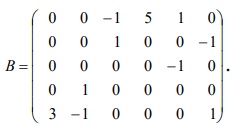
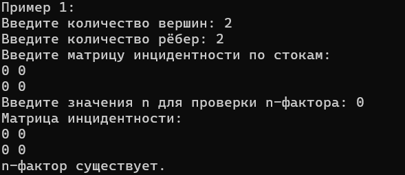
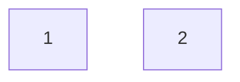
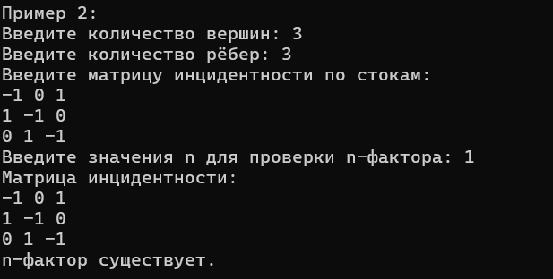
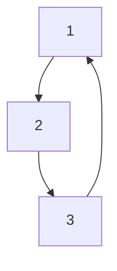
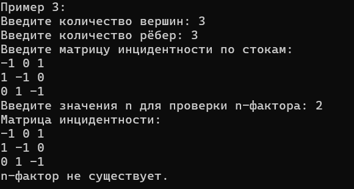
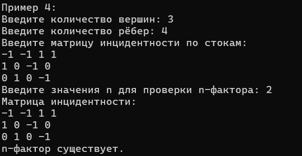
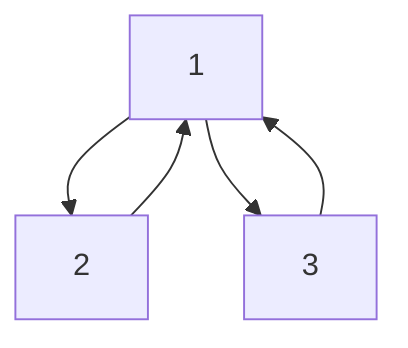
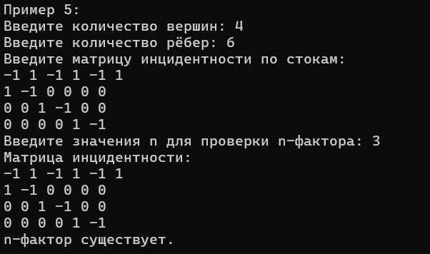
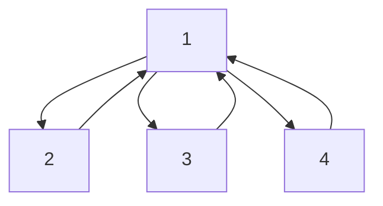

# Лабораторная работа №1


### Цель: 


Познакомиться с системой верстки текстов TeX, языком верстки TeX, издательской системой LaTeX.Выполнить вариант индивидуального задания.

### Основные используемые команды:
* `multicols`- для разбиения страницы на части;


* `itemize` - для создания списка;


* `textbf, textit` - форматирование текста


* $\coloneqq$` - специальные знаки (в данном случае ':=')


Другие сведения, и команды по работе с LaTeX можно посмотреть [здесь](https://www.overleaf.com/learn/latex/Learn_LaTeX_in_30_minutes)

Пример выполненого задания: 


# Лабораторная работа 3

### Цель: 

Познакомиться с программами git, освоить их программные аргументы.


### Про технологию:

 <b>Git</b> - это распределенное программное обеспечение для управления версиями. Контроль версий - это способ сохранять изменения с течением времени без перезаписи предыдущих версий. Распределение означает, что каждый разработчик, работающий с репозиторием Git, имеет копию всего этого репозитория - каждый фиксацию, каждую ветку, каждый файл.

 [Git](https://git-scm.com/)

 [GitHub](https://github.com/)
 
 ### Основные команды:
 
 1. Проверка стасуса

 ```
 git status
 ```
2. Добавление файлов

```
git add .
```
3. Создание коммита

```
git commit -m "message"
```
4. Загрузка на определенную ветку в GitHub

```
git push origin <название ветки>
```
### Ресурс для обучения командам Git [здесь](https://habr.com/ru/articles/541258/)

### Вывод: 
Мы познакомились с программами Git, освоили их программные аргументы.


# Расчетная работа

## Тема

<strong> Разработка программы решения теоретико-графовой задачи. </strong>

### Цель

Ознакомиться с основами теории графов, способами представления графов, базовыми алгоритмами для работы с разными видами графов.

### Задача
Необходимо определить n-фактор для указанного графа.
Нужно найти колличество входящих рёбер в вершину и выходящих. Граф задается матрицей интидентности, данные которой вводит пользователь. Вывод работы программы выводится в консоль, в 5-ти примерах.

.png)

#### Это пример ориентированного графа.



#### Это пример матрицы инцидентности.
### Вариант
5.31 ми, ог (Найти n-фактор для указанного графа)
ми - матрица инцидентности.
ог - ориентированный граф.

## Ключевые понятия

- **Графовая структура** (абсолютное понятие) - это такая одноуровневая реляционная струк-
тура, объекты которой могут играть роль либо вершины, либо связки:

   - Вершина (относительное понятие, ролевое отношение);

   - Связка (относительное понятие, ролевое отношение).

- **Граф** - совокупность двух множеств множества самих объектов, называемого множеством вершин, и множества их парных связей, называемого множества рёбер.

- **Ориентированный граф** - граф, в котором ребра имеют направления, то есть связь между вершинами односторонняя.

- **Неоринтированный граф** - граф, в котором ребра не имеют направления, то есть связь между вершинами двустронняя.

- **Матрица смежности** - квадратная матрица размера *n*&times;*n*, где *n* - количество вершин в графе. Каждый элемент матрицы [i][j] указывает наличие (1) или осутствие (0) ребра между вершинами *i* *j*.

- **Матрица инцидентности** - матрица размера *n*&times;*m*, где *n* - количество вершин, а *m* - количество ребер в графе. Каждый элеимент [i][j] указывает, инцидента ли вершина *i* ребру *j*.

- **Список смежности** (список инцидентности) - представление графа в виде массива списков, где каждый список содержит вершины, смежные с данной вершиной.

- **Степень вершины графа** - количество рёбер, для которых она является концевой(при этом петли считают дважды).

- **Планарный граф** - это граф, который можно нарисовать на плоскости без пересечения ребер. Другими словами, граф является плоским, если его можно вложить в плоскость так, чтобы никакие ребра не пересекались.
- **Взвешенный неориентированный граф** - граф, в котором каждому ребру приписан вес (например, длинна или стоимость) и  ребра не имеют направления (связи двусторонние).
- **Взвешенный ориентиованный граф** - граф, в котором каждому ребру приписан вес и ребра имеют направление (связи односторонние).
- **n-фактор графа** - это подмножество рёбер графа, которое образует подграф, где каждая вершина имеет степень, равную n. Проще говоря, n-фактор — это такой набор рёбер, который соединяет все вершины графа так, что у каждой вершины ровно n рёбер (или, в терминах теории графов, каждая вершина имеет степень n).
- **Реберная связь (или ребро)** - это связь между двумя вершинами. В неориентированном графе ребро обозначает двустороннюю связь, а в ориентированном графе ребро имеет направление, указывающее одностороннюю связь от одной вершины к другой.
- **Мост графа (или изолирующее ребро)** - это ребро в графе, удаление которого приводит к увеличению числа компонента связаности графа. Иными словами, мост соединяет две части графа, и его удаление разделяет граф на две и более несвязанные части.

## Алгоритм решения

   1. **Подключение библиотек** 
      - Используем библиотеки *<*iostream*>*, *<*vector*>* и *<*algorithm*>* для работы с вводом/выводом, динамическими массивами и сортировкой соответственно.
   2. **Определение функции NFact:**
      - Входные параметры:
         - const ***vector<*vector<*int>>& incMat***: матрица инцидентности графа.
         - int n: степень для проверки n-фактора.
      - Создаем векторы для хранения входных и выходных степеней вершин.
   3. **Вычисление степеней:**
      - Проходим по всем вершинам и рёбрам в матрице:
         - Увеличиваем ***outDeg*** для выходящих ребер *(значение -1)*.
         - Увеличиваем ***inDeg*** для входящих ребер *(значение 1)*.
   4. **Проверка условий для n-фактора:**
      - Создаем вектор ***od***, куда будем записыват степени вершин, где входная и выходная степень равны.
      - Заполняем ***od*** и сортируем его.
   5. **Проверка существования n-фактора:**
      - Если максимальное значение ***od*** равно ***n***, значит, **n-фактор** существует; возвращает *true*.
      - В противном случае *false*.
   6. **Определение функции inpMat:**
      -   Эта функция запрашивает у пользователя количество вершин и количество ребер, затем заполняет матрицу инцидентности.
   7. **Определение функции printMat:**
      - Функция выводит матрицу на экран.
   8. **Основная фукция main:**
      - Для начала устанавливаем локализацию для русского языка и запрашиваем количетво примеров.
         - Для каждого примера:
            - Запрашиваем количество вершин и ребер.
            - Пользователь вводит матрицу инцидентности.
            - Запрашиваем значение **n** и проверяем существование n-фактора с помощью функции NFact.
            - Выводим результат.
   9. Завершение работы программы:
      - программа завершает выполнение с кодом 0.

#### Пример кода:
```cpp
#include<iostream>
#include<vector>
#include <algorithm>

using namespace std;

bool NFact(const vector<vector<int>>& incMat, int n)
{
	int ver = incMat.size();

	vector<int> inDeg(ver, 0);
	vector<int> outDeg(ver, 0);

	for (int i = 0; i < ver; i++)
	{
		int ed = incMat[i].size();
		for (int j = 0; j < ed; j++)
		{

			if (incMat[i][j] == -1)
			{
				outDeg[i]++;
			}
			else if (incMat[i][j] == 1)
			{
				inDeg[i]++;
			}
		}
	}
	vector<int> od(ver, 0);
	for (int i = 0, j = 0; i < ver; i++)
	{
		if (inDeg[i] == outDeg[i])
		{
			od[j] = inDeg[i];
			j++;
		}
		
	}
	sort(od.begin(), od.end());
	if (od[od.size() - 1] == n) {
		return true;
	}
	else return false;
	
}

vector<vector<int>> inpMat(int ver, int ed)
{
	vector<vector<int>> mat(ver, vector<int>(ed));

	cout << "Введите матрицу инцидентности по стокам:" << endl;
	for (int i = 0; i < ver; i++)
	{
		for (int j = 0; j < ed; j++)
		{
			cin >> mat[i][j];
		}
	}
	return mat;
}

void printMat(const vector<vector<int>>& mat)
{
	for (const auto& row : mat)
	{
		for (int val : row)
		{
			cout << val << " ";
		}
		cout << endl;
	}
}

int main()
{
	setlocale(LC_ALL, "rus");

	int exaConst;

	cout << "Введите количество примеров для проверки: ";
	cin >> exaConst;

	for (int example = 1; example <= exaConst; example++)
	{
		cout << "Пример " << example << ":" << endl;


		int ver, ed, n;
		cout << "Введите количество вершин: ";
		cin >> ver;
		cout << "Введите количество рёбер: ";
		cin >> ed;

		auto incMat = inpMat(ver, ed);

		cout << "Введите значения n для проверки n-фактора: ";
		cin >> n;

		cout << "Матрица инцидентности: " << endl;
		printMat(incMat);

		if (NFact(incMat, n))
		{
			cout << "n-фактор существует." << endl;
		}
		else
		{
			cout << "n-фактор не существует." << endl;
		}
		cout << "....................................." << endl;
	}
	return 0;
}
```
## Примеры выполнения работы программы:

### Пример 1

***Матрица инцидентности в этом примере:***

|0  |0  |
|---|---|
|0  |0  |



- В данном примере n-фактор существует, т.к. количество входивших и выходивших ребер в одну вершину равное. В данном примере 0.



### Пример 2

***Матрица инцидентности в этом примере:***

|-1 |0  |1  |
|---|---|---|
|1  |-1 |0  |
|0  |1  |-1 |




- Тут аналогично первому примеру n-фактор определен, и он равен 1. Но в первом примере у нас была нулевая матрица инцидентности и условие выполнялось, т.к. ноль векторов входило и ноль векторов выходило. В данном примере один вектор выходит и входит, в каждую из вершин.


### Пример 3

***Матрица инцидентности в этом примере:***

|-1 |0  |1  |
|---|---|---|
|1  |-1 |0  |
|0  |1  |-1 |



- В данном примере пользователь проверяет на существовании n-фактора второй степени, (*схема такая же как во втором примере*) и программа говорит что **n-фактора не существует**, т.к. для n-фактора второй степени нужно чтобы в хотя бы одну вершину входило два ребра. *Важно понимать, чтобы **n-фактор** был определен, необходимо и достаточно, чтобы в каждую вершину входило и выходило равное количество вершин, а степень **n-фактора** определяется по наибольшему количеству, если условие его существования выполняются.*

### Пример 4

***Матрица инцидентности в этом примере:***

|-1 |-1 |1  |1  |
|---|---|---|---|
|1  |0  |-1 |0  |
|0  |1  |0  |-1 |



- Вот пример когда n-фактор определен и его степень равна 2.



### Пример 5

***Матрица инцидентности в этом примере:***

|-1 |1  |-1 |1  |-1 |1  |
|---|---|---|---|---|---|
|1  |-1 |0  |0  |0  |0  |
|0  |0  |1  |-1 |0  |0  |
|0  |0  |0  |0  |1  |-1 |



- В данном примере n-фактор определен и его степень равна 3.



## Вывод

В результате выполнения данной работы были получены следующие практические навыки: изучены основы теории графов, изучены способы представления графов, изучены базоовые алгорится для работы с графами.
